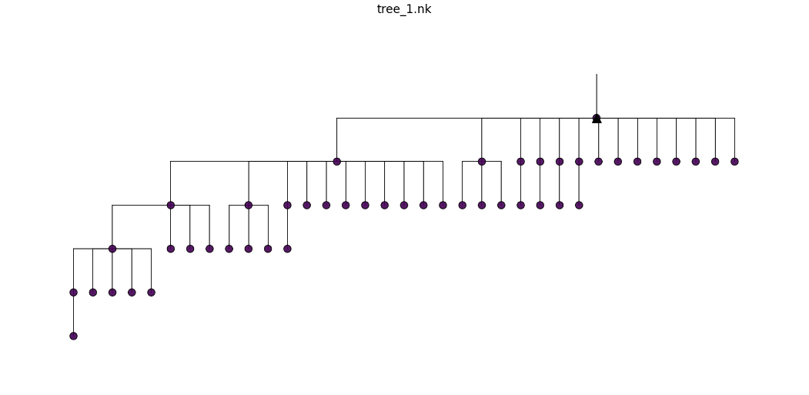
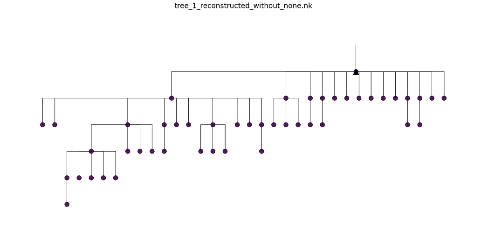
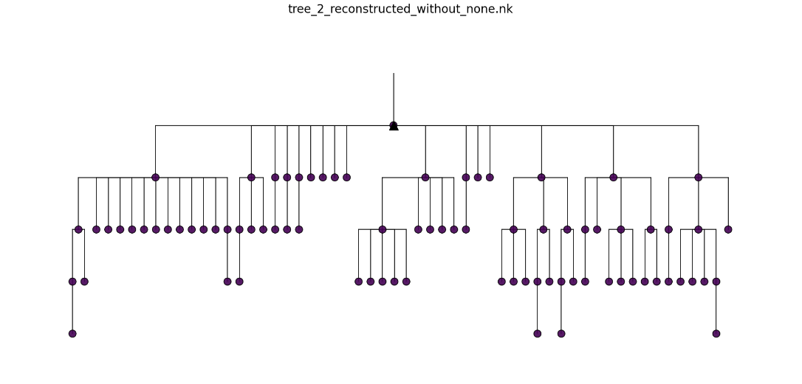
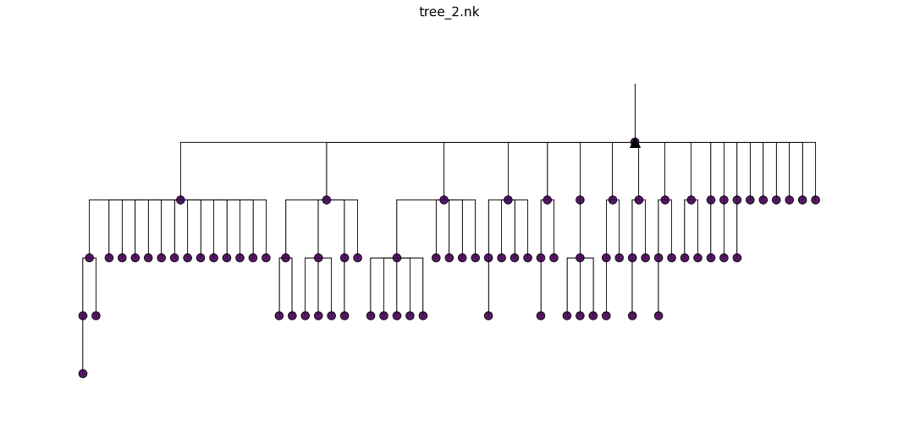
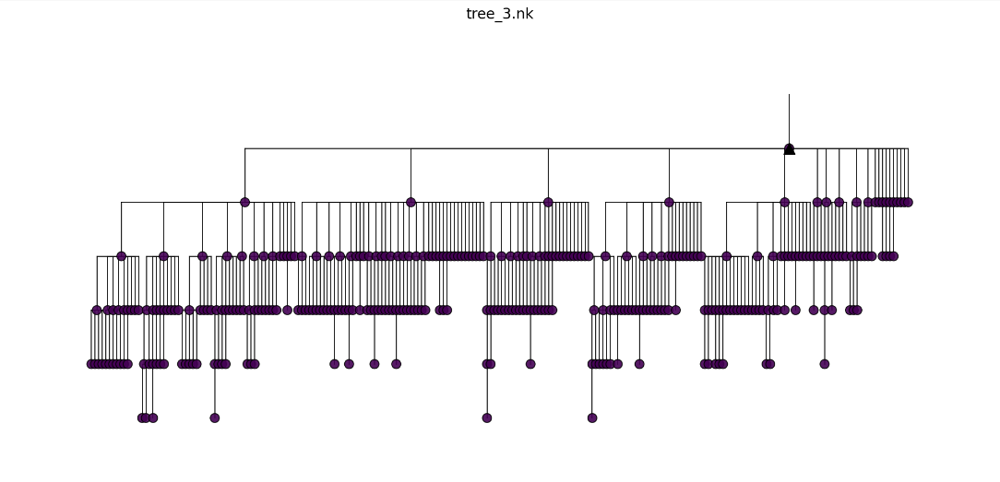
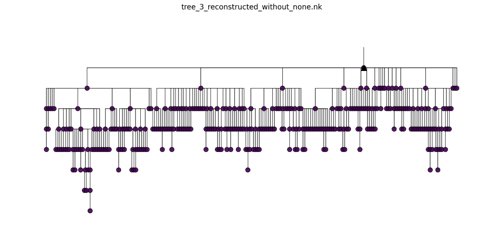
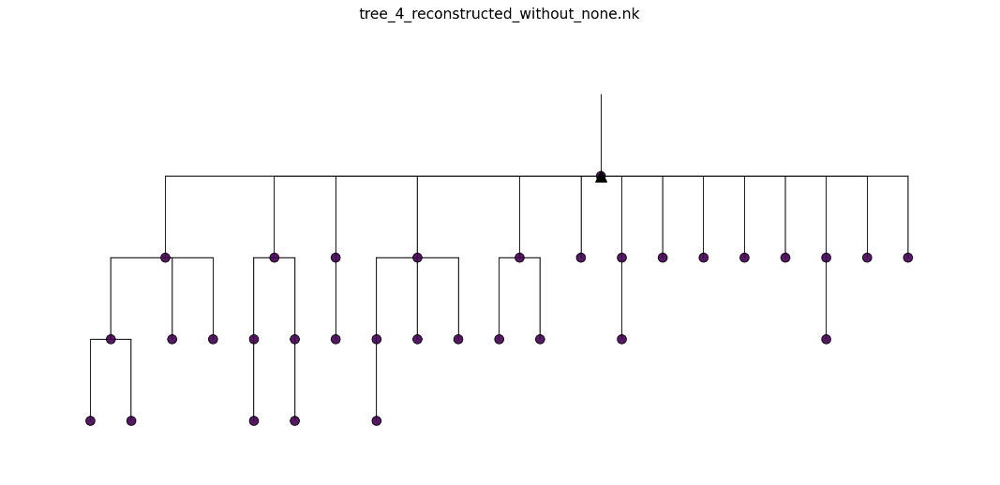
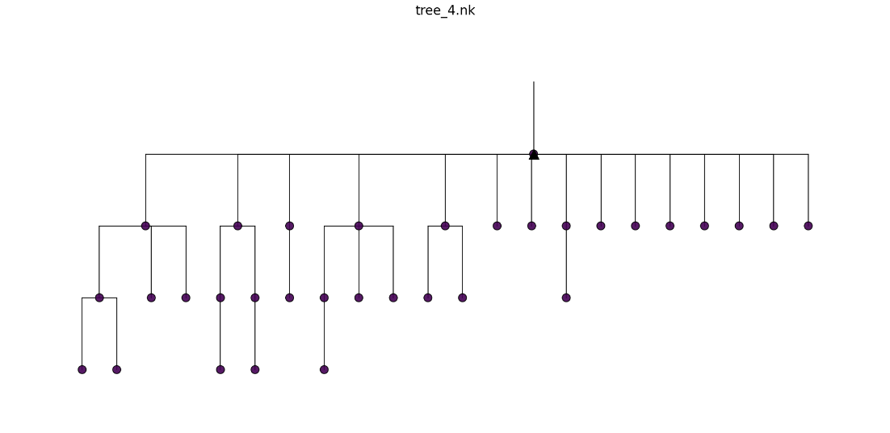

# Ancestra-Echo — Nucleotide Tree Reconstruction

Comparison of reconstructed nucleotide trees with their corresponding ground-truth trees. The figures and tree metadata are taken from the original Ancestra-Echo nucleotide document.

## Ground-Truth Tree Statistics

| Tree | Nodes | Unique Sequences | Depth (Generations) | Total Abundance | Maximum Node Abundance | Maximum Allowed Generations | Minimum Requested Sequences | PSSM Mode |
|---|---:|---:|---:|---:|---:|---:|---:|---:|---|
| Tree 1 | 53 | 53 | 6 | 62 | 8 | 25 | 30 | Nucleotide |
| Tree 2 | 94 | 94 | 7 | 114 | 6 | 22 | 80 | Nucleotide |
| Tree 3 | 378 | 378 | 9 | 488 | 13 | 30 | 200 | Nucleotide |
| Tree 4 | 36 | 36 | 6 | 50 | 4 | 10 | 25 | Nucleotide |

## Reconstructed Trees vs. Ground Truth

### Tree 1

- **Number of nodes:** 53
- **Unique sequences:** 53
- **Tree depth:** 6 generations
- **Total abundance:** 62
- **Maximum node abundance:** 8
- **Maximum allowed generations:** 25
- **Minimum requested sequences:** 30
- **PSSM mode:** Nucleotide

**Reconstructed Nucleotide Tree**

**Ground-Truth Tree**

### Tree 2

- **Number of nodes:** 94
- **Unique sequences:** 94
- **Tree depth:** 7 generations
- **Total abundance:** 114
- **Maximum node abundance:** 6
- **Maximum allowed generations:** 22
- **Minimum requested sequences:** 80
- **PSSM mode:** Nucleotide

**Reconstructed Nucleotide Tree**

**Ground-Truth Tree**

### Tree 3

- **Number of nodes:** 378
- **Unique sequences:** 378
- **Tree depth:** 9 generations
- **Total abundance:** 488
- **Maximum node abundance:** 13
- **Maximum allowed generations:** 30
- **Minimum requested sequences:** 200
- **PSSM mode:** Nucleotide

**Reconstructed Nucleotide Tree**

**Ground-Truth Tree**

### Tree 4

- **Number of nodes:** 36
- **Unique sequences:** 36
- **Tree depth:** 6 generations
- **Total abundance:** 50
- **Maximum node abundance:** 4
- **Maximum allowed generations:** 10
- **Minimum requested sequences:** 25
- **PSSM mode:** Nucleotide

**Reconstructed Nucleotide Tree**

**Ground-Truth Tree**

